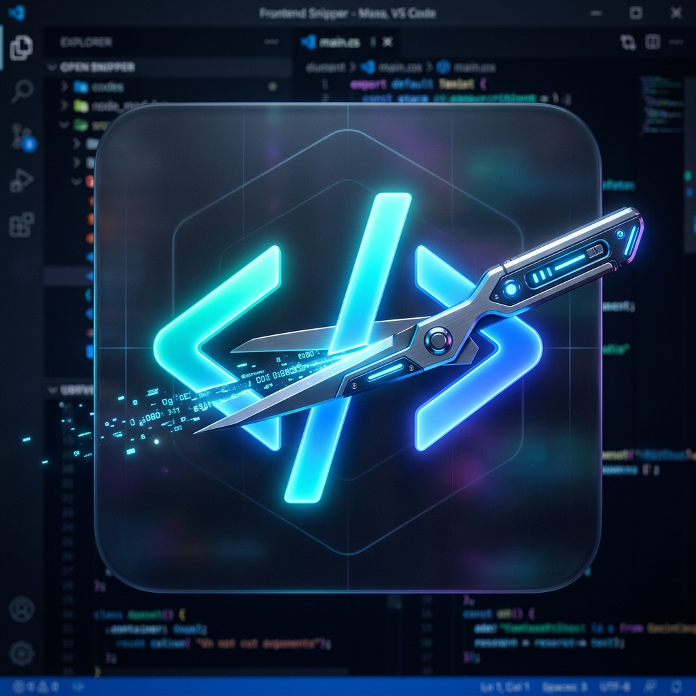
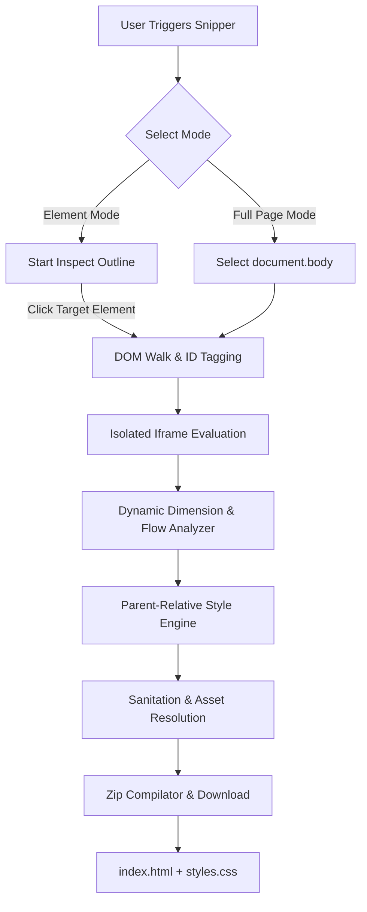

<div align="center">

  

  # ⚡ Frontend Snipper

  ### *Capture the Web, Pixel-Perfect, Instantly.*

  [](https://github.com/)
  [](https://developer.chrome.com/docs/extensions/mv3/intro/)
  [](https://github.com/)
  [](https://github.com/)

  Frontend Snipper is a premium developer-focused Chrome extension designed to extract visual HTML structures and their fully resolved computed CSS styling into a single, clean, and portable offline package (.zip) — preserving responsiveness, font assets, and custom overrides.

</div>

---

## 🌟 Key Features

*   **🔍 Precision Hover Inspector**: Visually select any DOM element with a responsive neon-cyan overlay that dynamically scales to parent bounds.
*   **📄 Full-Page Capture**: Snip the entire document tree recursively and compile it into a structured layout with a single click.
*   **🎨 CSS Inheritance Resolution Engine**: Automatically compares computed styles against parents and ancestors. Writes style differences dynamically so nested elements retain overrides (e.g. transparent inputs, custom button colors) without falling back to grey browser defaults.
*   **📐 Dynamic Dimension & Flow Analyzer**: Performs real-time, invisible, synchronous `auto` overrides to check if elements flow naturally. Skips redundant responsive widths while locking fixed layout dimensions to prevent layout collapse.
*   **🧬 Global Root Styles**: Captures configurations from `html` and `body` (backgrounds, text sizes, scrollings) and writes clean `html { ... }` rules.
*   **📦 Bundled Packaging**: Compiles structural HTML, computed styles, font dependencies, and online font links into a portable, instant `.zip` archive.
*   **✨ Glassmorphic Sidebar UI**: Features HSL-curated dark tones, backdrop filters, custom SVG icons, micro-animations, and interactive code previewers.

---

## 🛠️ Architecture and Styling Flow



---

## 🚀 Installation & Setup

1.  **Clone the Repository**:
    ```bash
    git clone https://github.com/yourusername/frontend-snipper.git
    ```
2.  **Load in Chrome**:
    *   Open Chrome and navigate to `chrome://extensions/`
    *   Enable **Developer Mode** (top-right toggle).
    *   Click **Load unpacked** (top-left button) and select the `Source Copyer` project directory.
3.  **Run the Extension**:
    *   Pin the **Frontend Snipper** icon in the toolbar.
    *   Navigate to any website, click the icon, and slide open the glassmorphic control drawer.

---

## 📂 Project Directory Structure

```yaml
e:\Source Copyer\
├── manifest.json       # Extension configurations, permissions, and script bindings
├── background.js      # Background service worker coordinating downloads
├── icon_4k.png        # Original 4K high-resolution app artwork
├── icon_128.png       # Standard asset sizes (downscaled via System.Drawing)
├── icon_48.png
├── icon_32.png
├── icon_16.png
├── libs/
│   └── jszip.min.js   # Fast compression library for compiling ZIP packages
└── content/
    ├── ui.js          # Shadow DOM sidebar panel controller, tabs, and styling
    ├── snipper.js     # Computed CSS compilation & dynamic dimension extractor
    └── theme.css      # Highlight overlays, keyframes, and animation classes
```

---

## 💎 Advanced Mechanics

### 1. The Iframe Isolation Technique
When querying browser defaults to discard boilerplate rules, querying directly in the host page yields polluted values (due to global resets like `* { box-sizing: border-box; }`). 
Frontend Snipper launches a synchronous, sandboxed `iframe` to check **pure, clean browser defaults**.

### 2. Relative Style Comparisons
```css
/* Generates clean, optimized, and dry rules */
[data-snip-id="snip-10"] {
  display: flex;
  color: rgb(255, 0, 0); /* Written because it differs from parent default */
  /* font-family is inherited and omitted here for cleanliness */
}
```

> [!TIP]
> **Why are there no unknown whitespaces?**
> The extension detects natural text flow vs. explicit sizing boundaries using temporary dimension resets (`width: auto`, `height: auto`), only writing sizing rules if they differ. This keeps the output responsive yet visually identical.

---

<div align="center">
  <sub>Built by Prithwiraj Das with ❤️ for front-end developers and designers.</sub>
</div>

